This repository contains the supporting material for the paper *Intent-based Satisfaction Modeling – From Music to Video Streaming*. A reproducibility study of [Mehrotra et. al. 2019](https://rishabhmehrotra.com/papers/WWW2019-intent-mehrotra.pdf).

The plots shown here are made with real Videoland data. In order to run the code yourself, download the repo and run the .Rmd file. Trivial data simulation is provided below instead of real user data (GDPR compliance). You can expect therefore the plots to change.

*Change this value to false, to make the code executable with fake data*


```r
realData = T
```


# libraries


```r
# data wrangling
library(data.table) # faster and arguably nice syntax
library(magrittr) # allows piping such as %>% or %<>%
library(stringr) # for string operations like str_replace
library(tidyr) # separate
library(knitr) # especially to make tables with kable
library(dplyr)
library(purrr)
library(MASS)

# plotting
library(ggcorrplot)
library(ggplot2)

# Bayes
library(tidybayes)
library(bayesplot) # plot bayesian model
```

# Data prep


## Trivial Fake Data

This is probably a research topic of its own. This data is only there for the code to run. We thus go with the simplest approach, without considering correlations between variables.


```r
possibleIntents <- c('Decisive - catch-up' , 'Decisive - continuewatching' , 'Decisive - livetv' , 'Decisive - specifictitle' , 'Explorative - addwatchlist' , 'Explorative - genre' , 'Explorative - new' , 'Explorative - watchlist')

behaviorNames <- c('numPlays' , 'timeToFirstPlay' , 'numTrailerPlays' , 'timeToFirstTrailer' , 'nBookmarks' , 'nProfileClicks' , 'nAccounts' , 'nStrips' , 'nSearches' , 'nSeriesDescr' , 'nMoviesDescr' , 'sessionLength')
  
possibleIntentsOrigNames <- c("Decisive_catch-up", "Decisive_continuewatching", "Decisive_livetv", "Decisive_specifictitle", "Inspiration_addwatchlist",  "Inspiration_genre", "Inspiration_new", "Inspiration_watchlist")

N <- 3000

responded <- data.frame(satisfaction = sample(1:5, N, replace = T)) %>% setDT
for(i in 1:length(possibleIntents)){
  responded[,  (possibleIntents[i]) := sample(0:1, N, replace = T)]
}
for(i in 1:length(behaviorNames)){
  responded[,  (behaviorNames[i]) := rnegbin(N, mu = 1, theta = 1)]
}
responded[, sessionId := 1:N]

measureVars <- names(responded) %>% .[grep("-",.)]
idVars <- names(responded) %>% .[-grep("-",.)]

intentsLong <- melt(responded, id.vars = idVars, measure.vars = measureVars, 
                      variable.name = "intent")[order(sessionId)][value == 1, !"value"] %>%
                      separate(intent, c("group", "intent"), "-")

behaviorLong <- melt(responded, id.vars = c("sessionId", "satisfaction"),
                     measure.vars = behaviorNames,
                     variable.name = "behavioral variable")
```

## Behavioral data

If you are running a website and are tracking users with Google Analytics, the Bigquery code [here](source/intentRetrieval.sql), will allow you to retrieve the same behavioral data as ours. Custom dimensions are proper to our platform and will differ depending on your setup.

## available Vars


```r
behaviors <- behaviorNames %>% paste(., collapse =" + ") # useful for modelling

possibleIntents <- names(responded[,`Decisive - catch-up`:`Explorative - watchlist`])

kable(list(data.frame("intents" = possibleIntents), data.frame("behaviorals" = behaviorNames)))
```


|intents                     |
|:---------------------------|
|Decisive - catch-up         |
|Decisive - continuewatching |
|Decisive - livetv           |
|Decisive - specifictitle    |
|Explorative - addwatchlist  |
|Explorative - genre         |
|Explorative - new           |
|Explorative - watchlist     |

|behaviorals        |
|:------------------|
|numPlays           |
|timeToFirstPlay    |
|numTrailerPlays    |
|timeToFirstTrailer |
|nBookmarks         |
|nProfileClicks     |
|nAccounts          |
|nStrips            |
|nSearches          |
|nSeriesDescr       |
|nMoviesDescr       |
|sessionLength      |

# Vizualizations

## Descriptive stats on Behavioral Vars

We show log values given the skewness of the data


```r
responded[, ..behaviorNames] %>% gather %>% ggplot(aes(log(value))) + 
  facet_wrap(~ key, scales = "free") + geom_histogram()
```

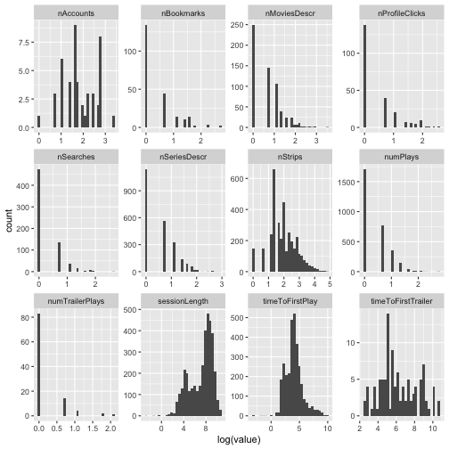

```r
# d[, ..behaviorNames] %>% gather %>% ggplot(aes(log(value))) + 
#   facet_wrap(~ key, scales = "free") + geom_histogram()
```

### for the quite satisfied (y >= 4)


```r
responded[satisfaction >= 4, sessionLength:nStrips] %>%
  keep(is.numeric) %>% 
  gather() %>% 
  ggplot(aes(log(value))) +
    facet_wrap(~ key, scales = "free") +
    geom_histogram()
```

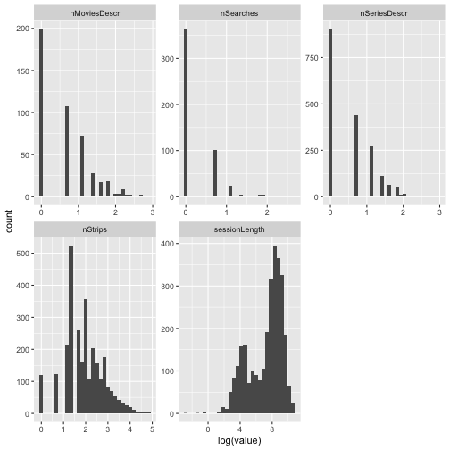

```r
# intents[satisfactionBin == 1, sessionLengthByHit:nStrips] %>%
#   keep(is.numeric) %>% 
#   gather() %>% 
#   ggplot(aes(log(value))) +
#     facet_wrap(~ key, scales = "free") +
#     geom_histogram()
```

### for the less satisfied (y<4)


```r
responded[satisfaction < 4, sessionLength:nStrips] %>%
  keep(is.numeric) %>% 
  gather() %>% 
  ggplot(aes(log(value))) +
    facet_wrap(~ key, scales = "free") +
    geom_histogram()
```

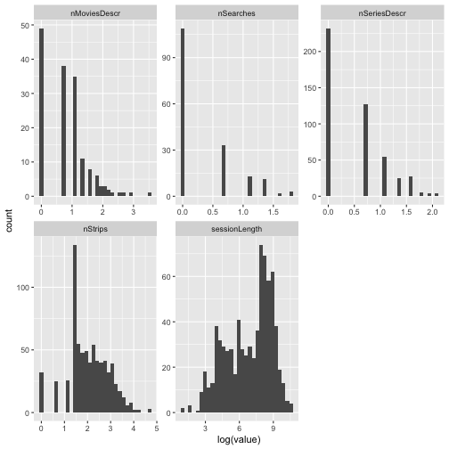

```r
# intents[satisfactionBin == 0, sessionLengthByHit:nStrips] %>%
#   keep(is.numeric) %>% 
#   gather() %>% 
#   ggplot(aes(log(value))) +
#     facet_wrap(~ key, scales = "free") +
#     geom_histogram()
```

## The Satisfaction histogram


```r
# Daltonian palette https://jfly.uni-koeln.de/color/
cbp1 <- c("#999999", "#E69F00", "#56B4E9", "#009E73",
          "#F0E442", "#0072B2", "#D55E00", "#CC79A7")

blue <-  cbp1[6]
orange <-  cbp1[2]

## hist
ggplot(responded, aes(x=satisfaction, y = ..count.., fill = satisfaction)) +
  geom_bar(width = 0.5, fill = blue) + theme_classic() +
  theme(text = element_text(size = 18))
```


## Violin Plots

### Violins of Satisfaction and Intents


```r
ggplot(intentsLong, aes(intent, satisfaction, fill = factor(group))) +
  # stat_summary(fun.y=mean, geom="point", shape=23, size=2) +
  geom_violin() +
  stat_summary(fun.y=mean, geom="point", color = "white") +
  # geom_jitter(shape=16, position=position_jitter(0.2), alpha = 1) +
  # geom_boxplot(width=0.1) +
  theme_classic() +
  theme(axis.text.x = element_text(size = 14)) +
  # theme(axis.text.x = element_text(angle = 45, hjust=1, size = 14)) +
  theme(axis.text.y = element_text(size = 14)) +
  theme(legend.position="none") +
  facet_grid(~group, 
             scales = "free_x", # Let the x axis vary across facets.
             space = "free_x",  # Let the width of facets vary and force all bars to have the same width.
             switch = "x") +
  theme(strip.placement = "outside",                      # Place facet labels outside x axis labels.
        strip.background = element_rect(fill = "grey90", color = "white"),
        strip.text = element_text(size = 14),# Make facet label background white.
        axis.title.x=element_blank(),
        axis.title.y=element_text(size = 14),
        text = element_text(size = 18))  +
  scale_fill_manual(values = c(blue, orange))
```

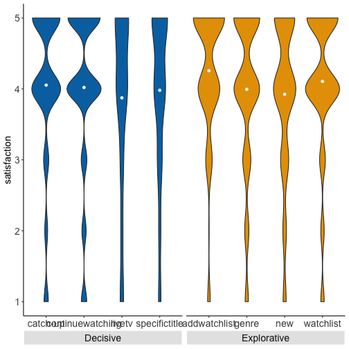

```r
# ggplot(intentsPure, aes(intent, satisfaction, fill = factor(group))) + 
#   # stat_summary(fun.y=mean, geom="point", shape=23, size=2) +
#   geom_violin() +
#   stat_summary(fun.y=mean, geom="point") +
#   # geom_jitter(shape=16, position=position_jitter(0.2), alpha = 1) +
#   # geom_boxplot(width=0.1) +
#   theme_classic() +
#   theme(axis.text.x = element_text(angle = 45, hjust=1, size = 14)) +
#   theme(axis.text.y = element_text(size = 14)) +
#   theme(legend.position="none") +
#   facet_grid(~group, 
#              scales = "free_x", # Let the x axis vary across facets.
#              space = "free_x",  # Let the width of facets vary and force all bars to have the same width.
#              switch = "x") +
#   theme(strip.placement = "outside",                      # Place facet labels outside x axis labels.
#         strip.background = element_rect(fill = "grey90", color = "white"),
#         strip.text = element_text(size = 14),# Make facet label background white.
#         axis.title.x=element_blank(),
#         axis.title.y=element_text(size = 14))  +
#   scale_fill_manual(values = cbp1[c(7,8)])
```


### Violins of Satisfaction and Behavioral Variables


```r
ggplot(behaviorLong[value >= 1], 
       aes(x= log(value), y = satisfaction, group = satisfaction, fill = as.factor(satisfaction))) +
  geom_violin() +
  facet_wrap(~`behavioral variable`, scales = "free") +
  theme_classic() +
  theme(legend.position="none") +
  scale_fill_brewer(palette="Set1")
```

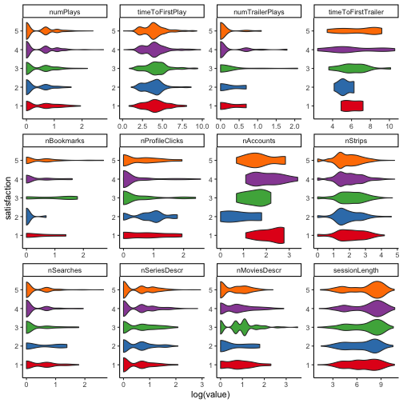

```r
# ggplot(satBehavLong[value >= 1], 
#        aes(x= log(value), y = satisfaction, group = satisfaction, fill = as.factor(satisfaction))) +
#   geom_violin() +
#   facet_wrap(~`behavioral variable`, scales = "free") +
#   theme_classic() +
#   theme(legend.position="none") +
#   scale_fill_brewer(palette="Set1")
```

## Corrplots


```r
## cor plot data prep

corrIntentBehav <- cor(responded[, `Decisive - catch-up`:`Explorative - watchlist`],
                       responded[, ..behaviorNames])

p.mat <- psych::corr.test(responded[, `Decisive - catch-up`:`Explorative - watchlist`],
                       responded[, ..behaviorNames]) #, adjust="none")

scaledCorr <- corrIntentBehav * 10
```

The original corrplot


```r
if(realData){
  ggcorrplot(scaledCorr, show.legend=T) + # lab = TRUE
    theme(text = element_text(size = 18)) +
    scale_fill_gradientn("",
                         colours = c("darkblue","white","red"),
                         values = scales::rescale(c(min(scaledCorr), 0, max(scaledCorr))),
                         labels = c(round(min(scaledCorr), 1), -0.60, 0,
                                    0.60, round(max(scaledCorr), 1)))
} else {
  ggcorrplot(scaledCorr, show.legend=T)
}
```

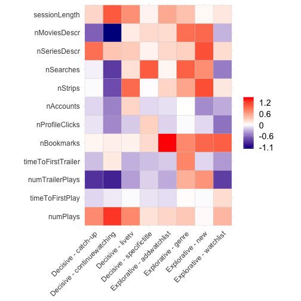

The corrplot with significance testing (corrected for multiple testing, significance level 0.05). A cross indicates insignificant correlations.


```r
if(realData){
  ggcorrplot(scaledCorr, show.legend=T, p.mat = p.mat$p, pch.cex = 2) + # lab = TRUE
    theme(text = element_text(size = 18)) +
  scale_fill_gradientn("",
                       colours = c("darkblue","white","red"),
                       values = scales::rescale(c(min(scaledCorr), 0, max(scaledCorr))),
                       labels = c(round(min(scaledCorr), 1), -0.60, 0,
                                  0.60, round(max(scaledCorr), 1)))
} else {
  ggcorrplot(scaledCorr, show.legend=T, p.mat = p.mat$p, pch.cex = 2)
}
```


# Modelling

5-fold trainval / test (80 / 20 %). For each trainval set, 5-fold tain / val (80 / 20 %).


```r
source("source/utils.R")

methodsParams <- list("w/o intent" = list(m = "logistic", withIntent = F, RE = F),
                      "w intent"  = list(m = "logistic", withIntent = T, RE = F),
                      "multilevel"  = list(m = "logistic", withIntent = T, RE = T),
                      "xgboost w/o intent" = list(m = "xgboost", withIntent = F, RE = F),
                      "xgboost w intent" = list(m = "xgboost", withIntent = T, RE = F))

overallResults <-
  rbind(
    crossT(5, 5, responded, response = "satisfactionBin", methodsParams),
    crossTByIntent(5,5, response = "satisfactionBin")
  )

satResults <-
  rbind(
    crossT(5, 5, responded, response = "satisfied", methodsParams),
    crossTByIntent(5,5, response = "satisfied")
  )


unsatResults <-
  rbind(
    crossT(5, 5, responded, response = "dissatisfied", methodsParams),
    crossTByIntent(5,5, response = "dissatisfied")
  )

results <- cbind(overallResults[,1],
                 overallResults[,Accuracy:F1],
                 satResults[,Accuracy:F1],
                 unsatResults[,Accuracy:F1])

kbl(results, format="latex", booktabs = T, escape = F, linesep = linesep(11)) %>%
  add_header_above(
    c(" " = 1,
      "Overall ($\\\\mathds{1}_{\\\\hat{\\\\mathbf{y}} \\\\geq 4}$)" = 4,
      "Satisfied ($\\\\mathds{1}_{\\\\hat{\\\\mathbf{y}} = 5}$)" = 4,
      "Unsatisfied ($\\\\mathds{1}_{\\\\hat{\\\\mathbf{y}} = 1}$)" = 4),
    escape = F)
```

## per intent logistic Bayes regression

### modelling


```r
for (i in possibleIntents){
  logisticBayes <- brm(
    formula = as.formula(paste("satisfactionBin ~", behaviors)),
    data = responded[intent == i],
    family = bernoulli(link = logit),
    file = paste0("models/logistic_", i, ".rds"),
    chains = 4, cores = 4, backend = "cmdstanr"
  )
}

logisticBayes <- do.call('rbind', lapply(list.files("models", full.names = TRUE, pattern = "logistic_"), readRDS))
```

### plotting


```r
posteriors <- list()

j <- 1
for (i in possibleIntentsOrigNames){
  thisBayes <- readRDS(paste0("../intentBasedClustering/models/logistic_", i, ".rds"))
  thisPosterior <- thisBayes %>% as.array
  thisBayes %<>% tidy_draws()
  notConverged <- thisBayes %>% summarise_draws() %>%
    setDT() %>% .[rhat > 1.05 & grepl("b_", variable) , variable]

  posteriors[[j]] <- thisPosterior %>% .[,,!dimnames(.)$variable %in% c(notConverged, "lp__", "Intercept")]
  
  thisBayes %<>%
    gather_variables() %>%
    setDT() %>% .[!.variable %in% notConverged] %>%
    .[, var := str_replace(.variable, "b_", "")] %>%
    .[var %in% behaviorNames, ] %>%
    .[, satisfaction := .value] %>%
      .[, intent := i] %>%
    .[]

  if(j == 1){
    logisticBayes <- thisBayes
  } else {
    logisticBayes <- rbind(logisticBayes, thisBayes)
  }
  j <- j + 1
}

logisticBayes[, index := .I]
logisticBayes[, varIntent := paste0(var, intent)]

medians <- logisticBayes[!var %in% c("numTrailerPlays")] %>% # "timeToFirstTrailer", 
  .[, .(intent = intent, median = abs(median(satisfaction))), by = .(varIntent)]
medians <- unique(medians)
topVars <- setorder(medians, intent, -median)[, head(.SD, 3), by = intent][, varIntent]

logisticBayes$intent %<>% str_replace("Inspiration", "Explorative") %>% str_replace("_", " - ")

logisticBayes[varIntent %in% topVars] %>%
  ggplot(aes(y = var, x = satisfaction, fill = var)) +
  facet_wrap(~intent, ncol = 4, scales = "free") +
  ## stat_gradientinterval() +
  stat_halfeye(scale = 1.5, point_size = 1.5) +
  geom_vline(xintercept = 0, linetype="dashed") +
  theme_classic() +
  theme(axis.title.y=element_blank()) +
  scale_fill_manual(values=cbp1) +
  theme(legend.position="none", strip.background = element_rect(fill = "white", color = "white")) +
  scale_x_continuous(labels = scales::number_format(accuracy = 0.1))
```

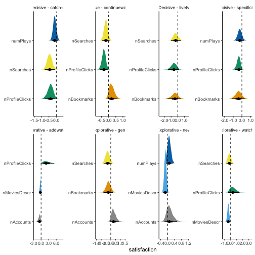

## Chain PLots

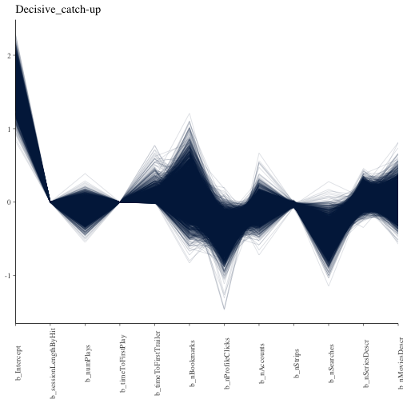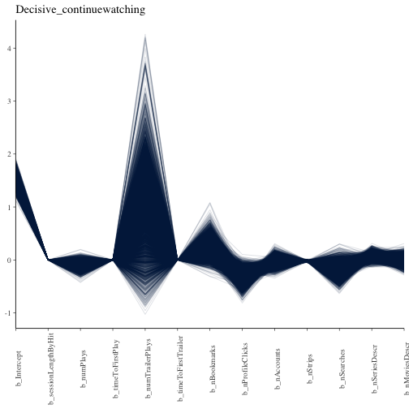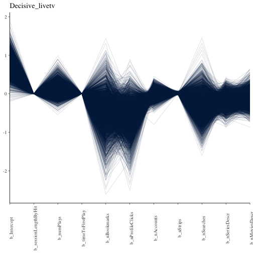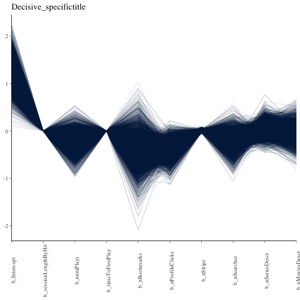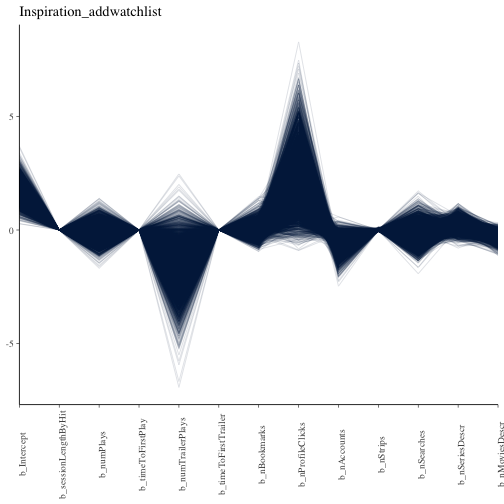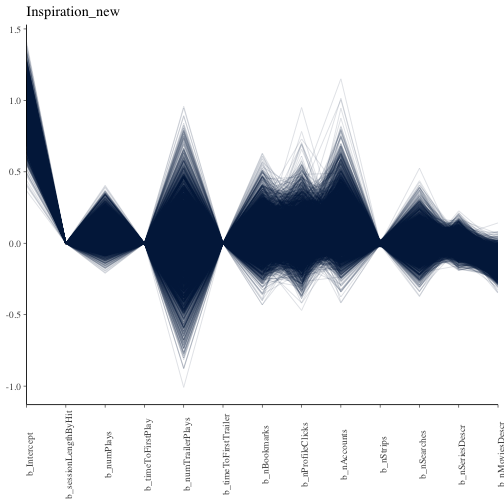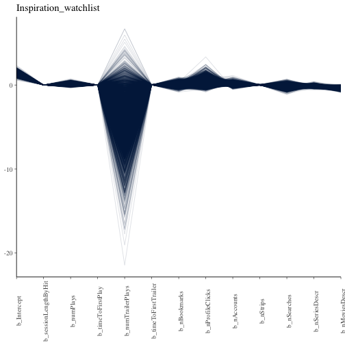

