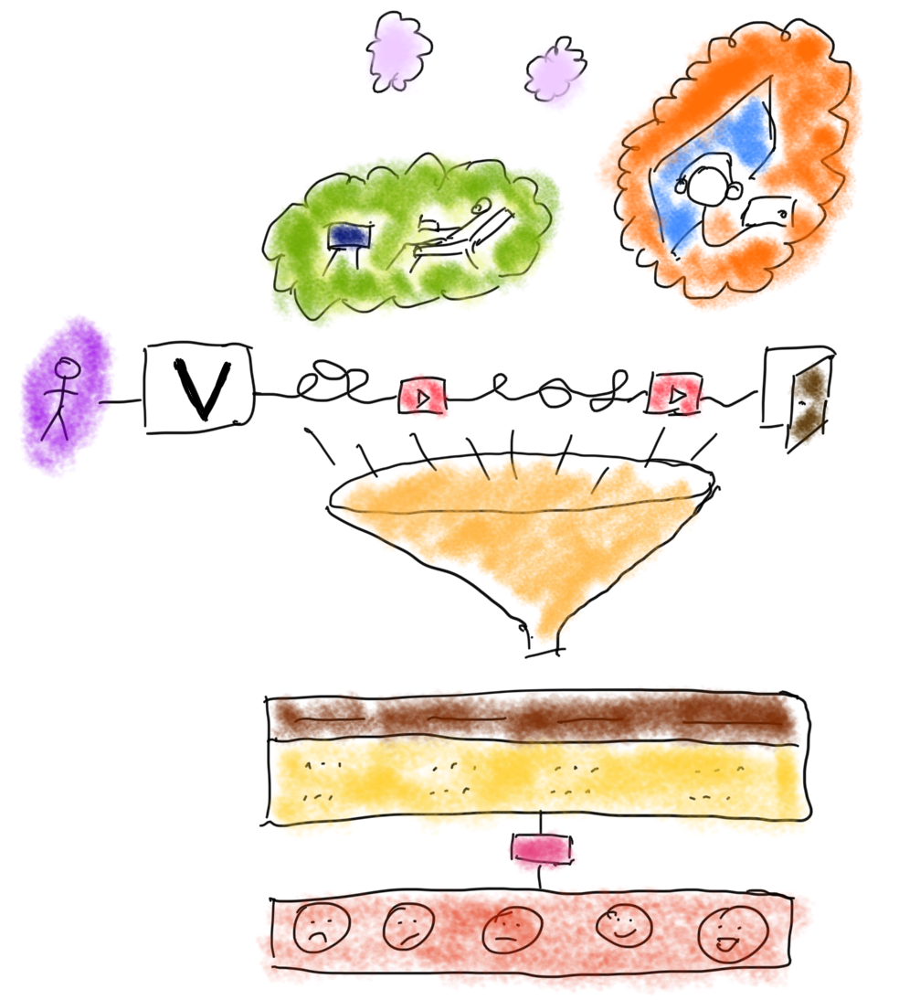
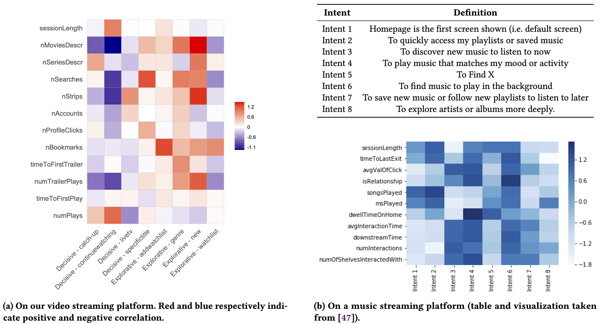
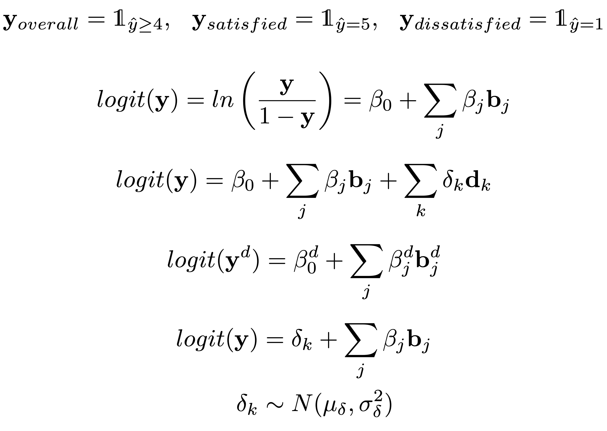
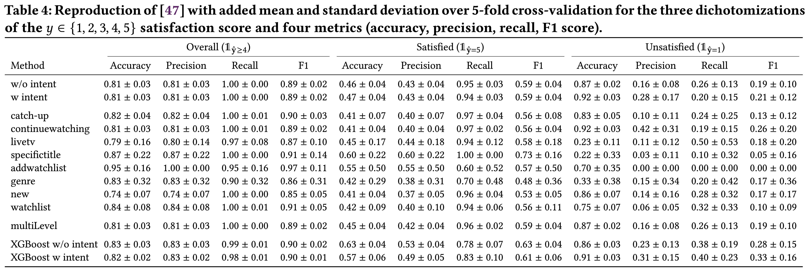

# Videoland@SIGIR (hopefuly)


<!-- ```{r, out.width="10%", echo=FALSE} -->


<!-- # library(magick) -->
<!-- #  -->
<!-- # img <- image_read("images/spotify.png") -->
<!-- #  -->
<!-- # img_with_border <- image_border(img, "white", "20x20") -->
<!-- #  -->
<!-- # image_write(img, "img.png") -->
<!-- # image_write(img_with_border, "img_with_border.png") -->
<!-- #  -->
<!-- # tempdir() -->

<!-- knitr::include_graphics(c("images/spotify.png","images/uva.png", "images/rtl.png")) #,out.width="10%",fig.show='hold',fig.align='center' -->
<!-- ```  -->

```{r,out.width="100%", out.height="100%", echo=FALSE}


# library(magick)
# 
# img <- image_read("images/spotify.png")
# 
# img_with_border <- image_border(img, "white", "20x20")
# 
# image_write(img, "img.png")
# image_write(img_with_border, "img_with_border.png")
# 
# tempdir()

knitr::include_graphics("../intentBasedClustering/intentBased/main.pdf") #,out.width="10%",fig.show='hold',fig.align='center'
``` 


# But what is Videoland?


```{r, fig.align='center', out.width="60%", fig.align='center', echo=FALSE}

```

# Behaviorals, Intents and Satisfaction


```{r, fig.align='center', out.width="60%", fig.align='center', echo=FALSE}

```


<!--  -->


 
<!-- This repository contains the supporting material for the paper *Intent-based Satisfaction Modeling – From Music to Video Streaming*. -->

<!-- The plots shown here are made with real Videoland data. In order to run the code yourself, clone the repo and run the .Rmd file. Trivial data simulation is provided below instead of real user data (GDPR compliance). You can expect therefore the plots to change. -->

```{r setup, include=FALSE}
knitr::opts_chunk$set(echo = T, warning = F, message = F, echo=F)
```

<!-- # libraries -->


```{r libraries}
# data wrangling
library(data.table) # faster and arguably nice syntax
library(magrittr) # allows piping such as %>% or %<>%
library(stringr) # for string operations like str_replace
library(tidyr) # separate
library(knitr) # especially to make tables with kable
library(dplyr)
library(purrr)

# plotting
library(ggcorrplot)
library(ggplot2)
library(ungeviz) # lines in plts
library(xkcd)

# Bayes
library(tidybayes)
library(bayesplot) # plot bayesian model

library(plotly)
library(shadowtext)
library(cowplot)

library(emo)

```

<!-- # Data prep -->

```{r dataLoading, echo=FALSE}

d <- read.csv("../intentBasedClustering/data/behavior-survey/20220120.csv") %>% setDT

## Could be done in SQL
d[is.na(d)] <- 0
setnames(d, "mood", "satisfaction")
d[, age := 2022 - birthDate]
d[, satisfactionBin := (satisfaction > 3) + 0]
d[, satisfied := (satisfaction == 5) + 0]
d[, dissatisfied := (satisfaction == 1) + 0]
d[, otherIntent := Ik_maak_ook_nog_om_deze_reden_ge]
d[, sessionLength := sessionLengthByHit]
d[, intent := `Reden_gebruik`]

```


```{r dataprep, echo=FALSE}

## one hot encoding of intents (Intents were originally all together in one column)
## repeat one row per intent
intents <- d[, .(intentHot = unlist(strsplit(intent, " / "))), by = names(d)] # , type.convert = TRUE
oneHot <- dcast(intents, ... ~ intentHot, fun = length)
possibleIntentsOrigNames <- names(oneHot[,`Decisive_catch-up`:Inspiration_watchlist])
names(oneHot) %<>% str_replace("Inspiration", "Explorative") %>% str_replace("_", " - ")

responded <- oneHot[intent != "",] # remove people who did not answer the second question
responded <- responded[eval(intents[, .(sessionId, intent)]), on = "sessionId"] # add intent back in

intentsPure <- separate(intents, intentHot, c("group", "intent"), "_")
intentsPure[, group := str_replace(group, "Inspiration", "Explorative")]
oneHotPure <- dcast(intentsPure, ... ~ intent, fun = length)

```


```{r available vars}
behaviorNames <- names(responded[,numPlays : sessionLength]) # get all behavior variable names
behaviors <- behaviorNames %>% paste(., collapse =" + ") # useful for modelling

possibleIntents <- names(responded[,`Decisive - catch-up`:`Explorative - watchlist`])

# kable(list(data.frame("intents" = possibleIntents), data.frame("behaviorals" = behaviorNames)))
```

# Data Collection


:::: {style="display: flex;"}

::: {}
```{r, fig.align='center', out.width="60%", echo=FALSE}
knitr::include_graphics(c("images/survey-satisfaction.png", "images/survey-intent.png"))
#knitr::include_graphics(c("image"))
```
:::

::: {}
```{r, fig.align='center', out.width="60%", echo=FALSE}
knitr::include_graphics(c("images/user-journey.png"))
#knitr::include_graphics(c("image"))
```
:::

::::

# Different Needs: Explorative VS Decisive Intents

```{r out.width = "60%", fig.align = "center"}
responded[, ..possibleIntents][, lapply(.SD, sum)] %>% melt %>% # .[,variable := factor(variable, levels = .[order(-value), variable])] %>% 
    ggplot(aes(x = variable, y = value, fill = variable)) + 
    geom_bar(stat = "identity") + theme(legend.position="none") + 
    theme_classic() +
    geom_shadowtext(aes(label=value), size=5, position=position_stack(vjust=0.5)) +
    theme(axis.title = element_blank(), axis.ticks = element_blank(), axis.line.y = element_blank(), axis.text.y = element_blank())  +
    scale_fill_brewer(palette="Paired", drop = F)+ theme(legend.position="none") +
    theme(axis.text.x = element_text(angle = 45, hjust=1, size = 15), # , vjust = -0.25, hjust=0
          plot.margin = margin(l = 100, unit = "pt"))

```


```{r}
# `-.gg` <- function(e1, e2) e2(e1)
# 
# 
# d[satisfaction == 1][order(-nStrips)][,.(userId, .SD), .SDcols = behaviorNames] %>%
#   melt(id = "userId") %>%
#   ggplot(aes(x = variable, y = log(value), color = userId)) + geom_point() + theme(legend.position="none") -
#   ggplotly
```

```{r}

singleUserStats <- function(id){
  # setnames(userPlot, "timeToFirstPlay", "timeToFirstPlay \n [s]")
  # setnames(userPlot, "sessionLength", "sessionLength \n [h]")
  thisUserPlot <- userPlot[Vuser == id][,..behaviorNames][, lapply(.SD, round, 1)] %>%
    setnames("timeToFirstPlay", "timeToFirstPlay \n [s]") %>% setnames("sessionLength", "sessionLength \n [h]") %>%
    melt
  avgUserPlot <- userPlot[,..behaviorNames] %>%
                 setnames("timeToFirstPlay", "timeToFirstPlay \n [s]") %>% setnames("sessionLength", "sessionLength \n [h]") %>% 
                 .[, lapply(.SD, mean)] %>% melt %>% .[thisUserPlot$value != 0, ]
  avgUserPlot[variable == "timeToFirstPlay \n [s]"]$value <- NA
  col <- "variable"
  thisUserPlot %>% .[value != 0] %>% #.[, (col) := factor(get(col), levels = rev(levels(get(col))))] %>%
    ggplot(aes(x = variable, y = value, fill = variable)) + geom_bar(stat = "identity") + theme(legend.position="none") + 
    theme_classic()  +
    geom_point(data = avgUserPlot, aes(x = variable, y = value), shape = 23, color = "white", fill = "red", size = 5) +
    geom_shadowtext(aes(label=value), size=5, position=position_stack(vjust=0.5)) +
    # ggtitle(paste(d[Vuser == id, intent], d[Vuser == id, satisfaction])) +
    theme(axis.title = element_blank(), axis.ticks = element_blank(), 
          axis.line.y = element_blank(), axis.text.y = element_blank(),
          axis.text.x = element_text(angle = 45, vjust = 0.5, hjust=0.5, size = 15),
          plot.margin = margin(t = 20, r = 25, l = 25, unit = "pt"))  +
    scale_fill_brewer(palette="Paired", drop = F)+ theme(legend.position="none")
    
}
```

```{r}
interestingUsers <- d[intent != ""][order(-nSearches), Vuser][c(1, 6, 20)]

userPlot <- d
userPlot[,sessionLength := sessionLength / 60 / 60]

# P <- list()
for (i in interestingUsers){
  # P[[i]] <- singleUserStats(i)
  singleUserStats(i)
  ggsave(paste0("images/", i,".png"))
}
# plot_grid(plotlist = P)
```


<!-- ## Trivial Fake Data -->

<!-- This is probably a research topic of its own. This data is only there for the code to run. We thus go with the simplest approach, without considering correlations between variables. -->

<!-- ```{r simulate data, eval = FALSE} -->
<!-- possibleIntents <- c('Decisive - catch-up' , ' Decisive - continuewatching' , ' Decisive - livetv' , ' Decisive - specifictitle' , ' Explorative - addwatchlist' , ' Explorative - genre' , ' Explorative - new' , ' Explorative - watchlist') -->

<!-- behaviorNames <- c('numPlays' , ' timeToFirstPlay' , ' numTrailerPlays' , ' timeToFirstTrailer' , ' nBookmarks' , ' nProfileClicks' , ' nAccounts' , ' nStrips' , ' nSearches' , ' nSeriesDescr' , ' nMoviesDescr' , ' sessionLength') -->

<!-- N <- 3000 -->

<!-- responded <- data.frame(satisfaction = sample(1:5, N, replace = T)) %>% setDT -->
<!-- responded[,  (possibleIntents) := sample(0:1, N, replace = T)] -->
<!-- responded[,  (behaviorNames) := rnegbin(N, mu = 1, theta = 1)] -->
<!-- ``` -->

<!-- ## Behavioral data -->

<!-- If you are running a website and are tracking users with Google Analytics, the Bigquery code [here](source/intentRetrieval.sql), will allow you to retrieve the same behavioral data as ours. Custom dimensions are proper to our platform and will differ depending on your setup. -->


<!-- ## available Vars -->


---

# Spotify VS Videoland

```{r, fig.align='center', out.width="100%", fig.align='center', echo=FALSE}

```


---

<!-- # Intents (Usabilla) VS Behaviorals (Google Analytics) -->

<!-- ```{r corrPrep} -->
<!-- ## cor plot data prep -->
<!-- corrIntentBehav <- cor(oneHot[, `Decisive - catch-up`:`Explorative - watchlist`], -->
<!--                        oneHot[, ..behaviorNames]) -->

<!-- p.mat <- psych::corr.test(oneHot[, `Decisive - catch-up`:`Explorative - watchlist`], -->
<!--                        oneHot[, ..behaviorNames]) #, adjust="none") -->

<!-- scaledCorr <- corrIntentBehav * 10 -->


<!-- ``` -->

<!-- <!-- The original corrplot --> -->

<!-- ```{r corrplot, out.width = "60%", fig.align = "center"} -->
<!-- ggcorrplot(scaledCorr, show.legend=T) + # lab = TRUE -->
<!--   scale_fill_gradientn("", -->
<!--                        colours = c("darkblue","white","red"), -->
<!--                        values = scales::rescale(c(min(scaledCorr), 0, max(scaledCorr))), -->
<!--                        labels = c(round(min(scaledCorr), 1), -0.60, 0, -->
<!--                                   0.60, round(max(scaledCorr), 1))) -->

<!-- ``` -->


# Everything is Awsome `r emo::ji("music")` (or is it?)

```{r satisfaction histogram, out.width = "60%", fig.align = "center"}

# Daltonian palette https://jfly.uni-koeln.de/color/
cbp1 <- c("#999999", "#E69F00", "#56B4E9", "#009E73",
          "#F0E442", "#0072B2", "#D55E00", "#CC79A7")

## hist
ggplot(d, aes(x=satisfaction, y = ..count.., fill = satisfaction)) +
  geom_bar(width = 0.5) + theme_classic() +
  theme(text = element_text(size = 14))

```

---

# a linear regression

```{r, fig.align='center', out.width="60%", fig.align='center', echo=FALSE}
# knitr::include_graphics(c("images/math_definitions.jpg", "images/math_logistic-regression.jpg",
#                         "images/math_regression-per-intent.jpg", "images/math_logistic-intent.jpg",
#                         "images/math_global-intent.jpg"))


```

---

# the results

```{r,out.width="100%", out.height="100%", echo=FALSE}
# knitr::include_graphics(c("images/math_definitions.jpg", "images/math_logistic-regression.jpg",
#                         "images/math_regression-per-intent.jpg", "images/math_logistic-intent.jpg",
#                         "images/math_global-intent.jpg"))


```

---

# Violin Plots (because Spotify did this, not because I love them)

## Satisfaction and Intents

```{r violin satisfaction intents, out.width = "60%", fig.align = "center"}
ggplot(intentsPure, aes(intent, satisfaction, fill = factor(group))) + 
  # stat_summary(fun.y=mean, geom="point", shape=23, size=2) +
  geom_violin() +
  stat_summary(fun.y=mean, geom="point") +
  # geom_jitter(shape=16, position=position_jitter(0.2), alpha = 1) +
  # geom_boxplot(width=0.1) +
  theme_classic() +
  theme(axis.text.x = element_text(angle = 45, hjust=1, size = 14)) +
  theme(axis.text.y = element_text(size = 14)) +
  theme(legend.position="none") +
  facet_grid(~group, 
             scales = "free_x", # Let the x axis vary across facets.
             space = "free_x",  # Let the width of facets vary and force all bars to have the same width.
             switch = "x") +
  theme(strip.placement = "outside",                      # Place facet labels outside x axis labels.
        strip.background = element_rect(fill = "grey90", color = "white"),
        strip.text = element_text(size = 14),# Make facet label background white.
        axis.title.x=element_blank(),
        axis.title.y=element_text(size = 14))  +
  scale_fill_manual(values = cbp1[c(7,8)])
```


## Violins of Satisfaction and Behavioral Variables

```{r violin satisfaction behaviorals, out.width = "60%", fig.align = "center"}

satBehavLong <- melt(intents, id.vars = c("sessionId", "satisfaction"),
                     measure.vars = behaviorNames,
                     variable.name = "behavioral variable")

ggplot(satBehavLong[value >= 1], 
       aes(x= log(value), y = satisfaction, group = satisfaction, fill = as.factor(satisfaction))) +
  geom_violin() +
  facet_wrap(~`behavioral variable`, scales = "free") +
  theme_classic() +
  theme(legend.position="none") +
  scale_fill_brewer(palette="Set1")

```


<!-- The corrplot with significance testing (corrected for multiple testing, significance level 0.05). A cross indicates insignificant correlations. -->

<!-- ```{r corrplot test} -->

<!-- ggcorrplot(scaledCorr, show.legend=T, p.mat = p.mat$p, pch.cex = 2) + # lab = TRUE -->
<!--   scale_fill_gradientn("", -->
<!--                        colours = c("darkblue","white","red"), -->
<!--                        values = scales::rescale(c(min(scaledCorr), 0, max(scaledCorr))), -->
<!--                        labels = c(round(min(scaledCorr), 1), -0.60, 0, -->
<!--                                   0.60, round(max(scaledCorr), 1))) -->

<!-- ``` -->

<!-- # Modelling -->

<!-- 5-fold trainval / test (80 / 20 %). For each trainval set, 5-fold tain / val (80 / 20 %). -->

<!-- ```{r modelling, eval= F} -->
<!-- source("source/utils.R") -->

<!-- methodsParams <- list("w/o intent" = list(m = "logistic", withIntent = F, RE = F), -->
<!--                       "w intent"  = list(m = "logistic", withIntent = T, RE = F), -->
<!--                       "multilevel"  = list(m = "logistic", withIntent = T, RE = T), -->
<!--                       "xgboost w/o intent" = list(m = "xgboost", withIntent = F, RE = F), -->
<!--                       "xgboost w intent" = list(m = "xgboost", withIntent = T, RE = F)) -->

<!-- overallResults <- -->
<!--   rbind( -->
<!--     crossT(5, 5, responded, response = "satisfactionBin", methodsParams), -->
<!--     crossTByIntent(5,5, response = "satisfactionBin") -->
<!--   ) -->

<!-- satResults <- -->
<!--   rbind( -->
<!--     crossT(5, 5, responded, response = "satisfied", methodsParams), -->
<!--     crossTByIntent(5,5, response = "satisfied") -->
<!--   ) -->


<!-- unsatResults <- -->
<!--   rbind( -->
<!--     crossT(5, 5, responded, response = "dissatisfied", methodsParams), -->
<!--     crossTByIntent(5,5, response = "dissatisfied") -->
<!--   ) -->

<!-- results <- cbind(overallResults[,1], -->
<!--                  overallResults[,Accuracy:F1], -->
<!--                  satResults[,Accuracy:F1], -->
<!--                  unsatResults[,Accuracy:F1]) -->

<!-- kbl(results, format="latex", booktabs = T, escape = F, linesep = linesep(11)) %>% -->
<!--   add_header_above( -->
<!--     c(" " = 1, -->
<!--       "Overall ($\\\\mathds{1}_{\\\\hat{\\\\mathbf{y}} \\\\geq 4}$)" = 4, -->
<!--       "Satisfied ($\\\\mathds{1}_{\\\\hat{\\\\mathbf{y}} = 5}$)" = 4, -->
<!--       "Unsatisfied ($\\\\mathds{1}_{\\\\hat{\\\\mathbf{y}} = 1}$)" = 4), -->
<!--     escape = F) -->

<!-- ``` -->


---

# per intent logistic Bayes regression

<!-- ### modelling -->

<!-- ```{r bayes modelling, eval = F} -->

<!-- for (i in possibleIntents){ -->
<!--   logisticBayes <- brm( -->
<!--     formula = as.formula(paste("satisfactionBin ~", behaviors)), -->
<!--     data = responded[intent == i], -->
<!--     family = bernoulli(link = logit), -->
<!--     file = paste0("models/logistic_", i, ".rds"), -->
<!--     chains = 4, cores = 4, backend = "cmdstanr" -->
<!--   ) -->
<!-- } -->

<!-- logisticBayes <- do.call('rbind', lapply(list.files("models", full.names = TRUE, pattern = "logistic_"), readRDS)) -->
<!-- ``` -->

<!-- ### plotting -->

```{r bayes plotting, fig.width = 17, fig.height = 8, fig.align = "center"}

posteriors <- list()

j <- 1
for (i in possibleIntentsOrigNames){
  thisBayes <- readRDS(paste0("../intentBasedClustering/models/logistic_", i, ".rds"))
  thisPosterior <- thisBayes %>% as.array
  thisBayes %<>% tidy_draws()
  notConverged <- thisBayes %>% summarise_draws() %>%
    setDT() %>% .[rhat > 1.05 & grepl("b_", variable) , variable]

  posteriors[[j]] <- thisPosterior %>% .[,,!dimnames(.)$variable %in% c(notConverged, "lp__", "Intercept")]
  
  thisBayes %<>%
    gather_variables() %>%
    setDT() %>% .[!.variable %in% notConverged] %>%
    .[, var := str_replace(.variable, "b_", "")] %>%
    .[var %in% behaviorNames, ] %>%
    .[, satisfaction := .value] %>%
      .[, intent := i] %>%
    .[]

  if(j == 1){
    logisticBayes <- thisBayes
  } else {
    logisticBayes <- rbind(logisticBayes, thisBayes)
  }
  j <- j + 1
}

logisticBayes[, index := .I]
logisticBayes[, varIntent := paste0(var, intent)]

medians <- logisticBayes[!var %in% c("numTrailerPlays")] %>% # "timeToFirstTrailer", 
  .[, .(intent = intent, median = abs(median(satisfaction))), by = .(varIntent)]
medians <- unique(medians)
topVars <- setorder(medians, intent, -median)[, head(.SD, 3), by = intent][, varIntent]

logisticBayes$intent %<>% str_replace("Inspiration", "Explorative") %>% str_replace("_", " - ")

logisticBayes[varIntent %in% topVars] %>%
  ggplot(aes(y = var, x = satisfaction, fill = var)) +
  facet_wrap(~intent, ncol = 4, scales = "free") +
  ## stat_gradientinterval() +
  stat_halfeye(scale = 1.5, point_size = 1.5) +
  geom_vline(xintercept = 0, linetype="dashed") +
  theme_classic() +
  theme(axis.title.y=element_blank()) +
  scale_fill_manual(values=cbp1) +
  theme(legend.position="none", strip.background = element_rect(fill = "white", color = "white"),
        text = element_text(size = 18)) +
  scale_x_continuous(labels = scales::number_format(accuracy = 0.1))

```

---

# What we learned

- satisfaction ~ intent + behaviorals
- explorative VS decisive
- cross-domain reproducibility

```{r, fig.align='center', out.width="60%", fig.align='center', echo=FALSE}

```


<!-- # Vizualizations -->

---

# Behavioral Variable Distributions

```{r log descriptive, out.width = "60%", fig.align = "center"}
d[, ..behaviorNames] %>% gather %>% ggplot(aes(value)) + 
  facet_wrap(~ key, scales = "free") + geom_histogram() + theme_classic() +
  scale_y_continuous(trans = "pseudo_log", breaks = c(0,3, 100, 1000, 4000))
```


---

## for the quite satisfied (y >= 4)

```{r log satisfied descriptive, out.width = "60%", fig.align = "center"}
intents[satisfactionBin == 1, sessionLengthByHit:nStrips] %>%
  keep(is.numeric) %>% 
  gather() %>% 
  ggplot(aes(log(value))) +
    facet_wrap(~ key, scales = "free") +
    geom_histogram() +
    scale_y_continuous(trans = "pseudo_log", breaks = c(0,3, 100, 1000, 4000))
```

## for the less satisfied (y<4)

```{r log unsatisfied descriptive, out.width = "60%", fig.align = "center"}
intents[satisfactionBin == 0, sessionLengthByHit:nStrips] %>%
  keep(is.numeric) %>% 
  gather() %>% 
  ggplot(aes(log(value))) +
    facet_wrap(~ key, scales = "free") +
    geom_histogram() +
    scale_y_continuous(trans = "pseudo_log", breaks = c(0,3, 100, 1000, 4000))
```

---